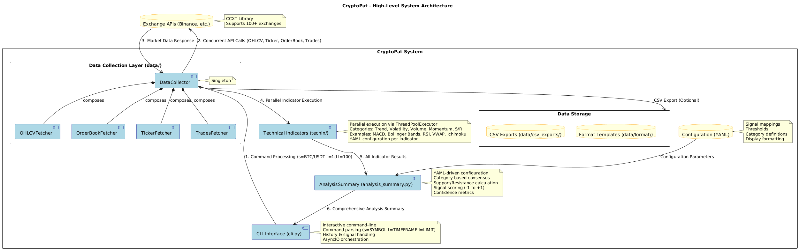

# CryptoPat
A comprehensive Python-based cryptocurrency pattern detection and technical analysis system. CryptoPat fetches real-time market data from exchanges and performs advanced analysis using technical indicators



### Technical Analysis Suite
- **Trend Indicators**: MACD, EMA (20/50), Parabolic SAR, Supertrend
- **Volatility Analysis**: Bollinger Bands, Keltner Channel, Donchian Channel, ATR
- **Volume Indicators**: OBV (On-Balance Volume), VWAP, Chaikin Money Flow
- **Momentum Oscillators**: RSI (Relative Strength Index), Stochastic
- **Support/Resistance**: Pivot Points, Ichimoku Cloud
- **Alternative Charting**: Renko Charts for noise filtering

### Real-Time Market Data
- **Exchange Integration**: Binance via CCXT library (extensible to 100+ exchanges)
- **Data Types**: OHLCV candlesticks, Level 2 order books, ticker data, recent trades
- **Timeframe Support**: 1d, 1w, 1M

## Installation

1. **Clone the repository**
   ```bash
   git clone <repository-url>
   cd cryptopat
   ```

2. **Setup virtual environment**
   ```bash
   python -m venv venv
   source venv/bin/activate  # Linux/Mac
   # venv\Scripts\activate   # Windows
   ```

3. **Install dependencies**
   ```bash
   pip install -r requirements.txt
   ```

## Usage

**Start the Interactive CLI**
```bash
python cli.py
```

**Command Syntax**
```bash
# Basic format: s=SYMBOL t=TIMEFRAME l=LIMIT

# Examples:
cryptopat> s=BTC/USDT t=1d l=100    # Bitcoin daily, 100 candles
cryptopat> s=ETH/USDT t=1w l=200    # Ethereum weekly, 200 candles

# Utility commands:
cryptopat> help                     # Show available commands
cryptopat> clear                    # Clear screen
cryptopat> exit                     # Exit application
```
